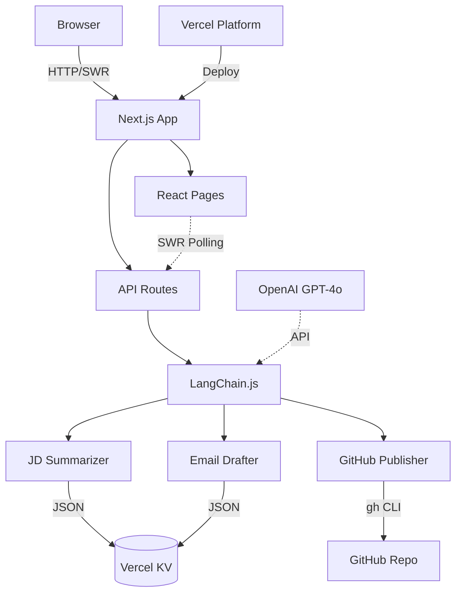

# VP Agent Demo - AI-Powered Job Application Assistant

An intelligent workflow that automates the creation of personalized VP-level job applications by analyzing job descriptions, matching your writing style, and organizing everything in GitHub.

> **Built for the Analog Devices VP Edge AI "Vibe Coder" Role** - This project implements the exact application requirements: summarize JD → draft VP-style email → post to GitHub

## 🎯 What This Does

This project creates an agentic workflow that:
1. **Analyzes job descriptions** - Extracts key requirements and company context
2. **Drafts personalized emails** - Mimics your VP-level communication style using your writing samples
3. **Organizes applications** - Automatically commits to GitHub with smart folder structure

Perfect for executives who want to maintain a personal touch while scaling their outreach.

## 🏗️ Architecture



## 🚀 Key Features

### Smart Job Description Analysis
- Extracts key responsibilities, requirements, and company culture
- Generates concise summaries (max 300 words)
- Identifies strategic priorities and leadership expectations
- JSON output for easy integration:
  ```json
  {
    "summary": "Concise role overview...",
    "key_requirements": ["GenAI expertise", "Rapid shipping", ...],
    "company_context": "Global semiconductor leader..."
  }
  ```

### VP-Style Email Generation
- Learns from your LinkedIn articles and writing samples
- Maintains your authentic voice and communication patterns
- Crafts compelling introductions that resonate with executive audiences
- JSON output with confidence scoring:
  ```json
  {
    "email_body": "Dear [VP Name], I'm excited about...",
    "subject": "Re: Vibe Coder-in-Residence Opportunity",
    "confidence_score": 0.92
  }
  ```

### Intelligent GitHub Organization
```
submissions/
├── analog_devices/
│   ├── README.md           # Auto-generated index
│   ├── role_summary.md     # JD analysis
│   ├── intro_email.md      # Your personalized email
│   └── resume.pdf          # Your resume
├── nvidia/
│   └── ...
```
- Creates organized folders by company
- Opens PRs for review: `submit/analog_devices-20240115`
- Maintains complete application history
- **Local**: Uses GitHub CLI (`gh`) for authentication
- **Vercel**: Uses GitHub token + Octokit API

### Dynamic Writing Sample Management
- Upload files (PDF/TXT/MD) or paste raw text
- Drag-and-drop multiple samples
- List view with preview & remove buttons
- Optional LinkedIn URL scraper
- Real-time style analysis
- Client-side word/character count and local persistence

### Preview & Edit Before Submission
- **Live preview panel** for all generated content
- **In-line editing** of summaries and emails
- **Retry individual agents** without restarting
- **Side-by-side comparison** of drafts
- **Approve/reject** mechanism before GitHub push

## 🛠️ Tech Stack

| Component | Technology | Purpose |
|-----------|------------|---------|
| **Full-Stack Framework** | Next.js 14 + TypeScript | Unified frontend + API routes |
| **AI Framework** | LangChain.js + OpenAI | Agent orchestration as specified in JD |
| **UI Components** | Tailwind CSS + shadcn/ui | Beautiful, accessible UI |
| **State Management** | SWR + Vercel KV | Real-time updates and persistence |
| **Deployment** | Vercel | One-click deployment |
| **Version Control** | GitHub CLI (via Node.js) | Automated commits |

## 📋 Prerequisites

### For Local Development
- Node.js 18+
- npm or yarn
- OpenAI API key
- GitHub CLI authenticated (`gh auth login`)

### For Vercel Deployment (Optional)
- Vercel CLI (`npm i -g vercel`)
- GitHub Personal Access Token (for API access)

## 🔧 Installation

### Option 1: Quick Start (Recommended)
```bash
./quickstart.sh
```

**First run** - Sets up everything:
- Creates a new Next.js project with TypeScript
- Installs all dependencies (LangChain.js, UI components, etc.)
- Sets up the project structure
- Creates type definitions
- Generates sample agent code
- Prompts you to add your OpenAI API key

**Subsequent runs** - Starts the app:
- Checks dependencies
- Verifies API key is configured
- Starts the development server
- Opens http://localhost:3000

### Option 2: Manual Setup

1. **Create the project**
   ```bash
   npx create-next-app@latest adi-vp-agent-demo --typescript --tailwind --app
   cd adi-vp-agent-demo
   ```

2. **Install dependencies**
   ```bash
   # Core dependencies
   npm install langchain @langchain/openai zod
   
   # UI and utilities
   npm install @radix-ui/themes lucide-react swr react-dropzone
   npm install class-variance-authority clsx tailwind-merge
   
   # Vercel KV for state storage
   npm install @vercel/kv
   ```

3. **Set up environment variables**
   ```bash
   # Create .env.local for local development
   cat > .env.local << EOF
   OPENAI_API_KEY=sk-your-key-here
   # For Vercel deployment only:
   # GITHUB_TOKEN=ghp_your_token_here
   # KV_URL=your_vercel_kv_url
   EOF
   ```

4. **Start the application**
   ```bash
   # First time: Creates project and prompts for API key
   ./quickstart.sh
   
   # After adding API key to .env.local
   ./quickstart.sh  # This now starts the dev server
   ```

5. **Daily usage**
   ```bash
   # Just run this every time you want to work on the project
   ./quickstart.sh
   ```

6. **Deploy to Vercel (when ready)**
   ```bash
   vercel
   # Follow prompts to deploy
   ```

## 🚦 Usage

1. **Start the application**
   ```bash
   ./quickstart.sh
   ```
   
   This script handles everything:
   - First time: Sets up the project
   - Every time: Starts the dev server

2. **Access the application**
   - Open http://localhost:3000
   - Enter company name
   - Upload or paste job description
   - Upload your resume (PDF)
   - Add writing samples (drag & drop or LinkedIn URLs)
   - Click "Generate Application"

4. **Review and refine**
   - Watch real-time progress updates
   - **Preview generated content before submission**
     - Edit JD summary if needed
     - Refine email draft in preview panel
     - Side-by-side comparison view
   - Use retry buttons for individual agents
   - Approve final content
   - Click PR link to see GitHub submission

## 📁 Project Structure

```
adi-vp-agent-demo/
├── app/                         # Next.js App Router
│   ├── api/                     # API Routes
│   │   ├── submit/route.ts
│   │   ├── status/[taskId]/route.ts
│   │   ├── retry/route.ts
│   │   ├── update/route.ts
│   │   └── approve/route.ts
│   ├── components/
│   │   ├── upload-panel.tsx
│   │   ├── sample-manager.tsx
│   │   ├── status-display.tsx
│   │   └── preview-panel.tsx
│   ├── layout.tsx
│   └── page.tsx                 # Home page
├── lib/
│   ├── agents/
│   │   ├── jd-summarizer.ts
│   │   ├── email-drafter.ts
│   │   └── github-publisher.ts
│   ├── langchain-config.ts
│   └── orchestrator.ts
├── types/
│   └── index.ts                 # TypeScript types
├── public/
├── submissions/                 # Generated applications
├── .env.local                   # Your API keys
├── package.json
├── tsconfig.json
├── tailwind.config.js
├── README.md
└── vercel.json                  # Vercel configuration
```

## 🔌 API Endpoints

| Method | Endpoint | Description |
|--------|----------|-------------|
| POST | `/api/submit` | Submit new application |
| GET | `/api/status/[taskId]` | Check processing status and get results |
| POST | `/api/retry` | Retry a specific agent |
| PUT | `/api/update` | Update agent output after editing |
| POST | `/api/approve` | Approve and push to GitHub |
| DELETE | `/api/sample` | Remove writing sample |

### API Response Format
All agents return structured JSON for easy integration:

```json
{
  "task_id": "uuid",
  "status": "completed",
  "agents": {
    "jd_summarizer": {
      "summary": "Role focuses on building GenAI agents...",
      "key_requirements": ["Ship daily", "LangChain expertise"],
      "company_context": "ADI is a global semiconductor leader..."
    },
    "email_drafter": {
      "email_body": "Dear VP Edge AI Team...",
      "subject": "Re: Vibe Coder-in-Residence",
      "confidence_score": 0.92
    },
    "github_publisher": {
      "repo_url": "https://github.com/username/repo",
      "pr_url": "https://github.com/username/repo/pull/1",
      "commit_sha": "abc123",
      "files_created": ["submissions/analog_devices/role_summary.md", ...]
    }
  }
}
```

## 🧪 Testing

```bash
# Run all tests
npm test

# Run in watch mode
npm run test:watch

# E2E tests with Playwright
npm run test:e2e

# Type checking
npm run type-check
```

## 🎨 Customization

### LangChain.js Agent Implementation
Each agent is implemented as a TypeScript module with structured outputs:

```typescript
// lib/agents/jd-summarizer.ts
import { ChatOpenAI } from "@langchain/openai";
import { z } from "zod";
import { StructuredOutputParser } from "langchain/output_parsers";

const outputSchema = z.object({
  summary: z.string().max(300),
  key_requirements: z.array(z.string()),
  company_context: z.string(),
});

export async function summarizeJD(jdText: string) {
  const model = new ChatOpenAI({ 
    modelName: "gpt-4o",
    temperature: 0.7 
  });
  
  const parser = StructuredOutputParser.fromZodSchema(outputSchema);
  const chain = model.pipe(parser);
  
  return await chain.invoke({
    messages: [{
      role: "user",
      content: `Analyze this job description: ${jdText}`
    }]
  });
}
```

### Adjusting Agent Behavior
Edit agent instructions in `backend/app/agents/`:
- Modify summarization rubric
- Tune email tone and style
- Change GitHub organization patterns
- Adjust LLM temperature and parameters

### UI Theming
The frontend uses Tailwind CSS with shadcn/ui components:
- Edit `frontend/tailwind.config.js` for colors
- Modify components in `frontend/components/ui/`

## 🏠 Local Development vs Vercel Deployment

### GitHub Integration
The app handles GitHub differently based on environment:

**Local Development**
- Uses GitHub CLI (`gh`) via Node.js child_process
- Requires `gh auth login` before running
- Direct file system access for submissions

**Vercel Deployment**
- Uses GitHub API via Octokit
- Requires `GITHUB_TOKEN` environment variable
- Creates commits via API calls

### Storage
**Local**: In-memory state (resets on restart)  
**Vercel**: Vercel KV for persistence

## 🚢 Deployment to Vercel

### Prerequisites for Vercel
1. Create a GitHub Personal Access Token:
   - Go to GitHub Settings → Developer settings → Personal access tokens
   - Generate new token with `repo` scope
   - Save as `GITHUB_TOKEN`

2. Install Vercel CLI:
   ```bash
   npm i -g vercel
   ```

### Deploy Steps
```bash
# Initial deployment
vercel

# Set environment variables
vercel env add OPENAI_API_KEY
vercel env add GITHUB_TOKEN

# Deploy to production
vercel --prod
```

### Alternative: Deploy via GitHub
1. Push to GitHub
2. Connect repo to Vercel
3. Set environment variables in Vercel dashboard
4. Automatic deploys on every push

### Environment Variables for Vercel
- `OPENAI_API_KEY` - Your OpenAI API key
- `GITHUB_TOKEN` - GitHub Personal Access Token
- `KV_URL` - Vercel KV database URL (auto-created)
- `NEXT_PUBLIC_APP_URL` - Your deployment URL

## 📊 Monitoring

- Agent performance metrics in `/metrics`
- Application logs in `logs/`
- GitHub webhook notifications (optional)

## 🤝 Contributing

1. Fork the repository
2. Create a feature branch
3. Make your changes
4. Add tests
5. Submit a pull request

## 📄 License

MIT License - feel free to use this for your job search!

## 🙋 FAQ

**Q: Can I use this with other AI providers?**  
A: Yes! The agent framework is provider-agnostic. Swap OpenAI for Anthropic, etc.

**Q: How do I add more agents?**  
A: Create a new agent in `backend/app/agents/` following the base class pattern.

**Q: Is my data secure?**  
A: Your API keys stay local. Resume/samples are only stored in your GitHub.